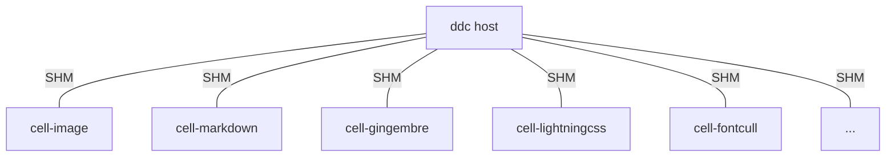

+++
title = "How It Works"
weight = 10
+++

This page gives a high-level view of dodeca's architecture for the curious.

## Host + Cells

dodeca runs as a **host** process that coordinates a set of **cell** processes. Each cell handles a specialized task — image processing, markdown rendering, SASS compilation, template rendering, font subsetting, etc.

Cells communicate with the host via [roam](https://github.com/bearcove/roam) RPC over shared memory. This avoids serialization overhead for large payloads like images and rendered HTML.

Cell binaries are named `ddc-cell-*` and are discovered on `PATH` at startup.

## Incremental computation

dodeca uses [picante](https://github.com/bearcove/picante) — an async incremental query system similar to Salsa. Every transformation is a tracked query:

- Parse markdown → query
- Render template → query
- Process image → query
- Subset font → query

Queries track their dependencies automatically. When a file changes, picante invalidates only the affected queries and re-runs them. Everything else is served from cache.

The query cache persists across restarts, so even a cold start benefits from previous work.

## Content-addressable storage

Large outputs (processed images, subsetted fonts) are stored in a content-addressable blob store (`.cache/blobs/`). Files are keyed by content hash — if two pages use the same image, it's processed once.

## Shared memory layout

Host-cell communication uses 4 size classes of shared memory slots:

| Size | Count | Purpose |
|------|-------|---------|
| 1 KB | 1024 | Small RPC arguments |
| 16 KB | 256 | Typical payloads |
| 256 KB | 32 | Images, CSS |
| 16 MB | 8 | Large blobs |

This avoids dynamic allocation in the hot path.

## Live reload

During `ddc serve`, dodeca diffs the old and new HTML using [hotmeal](https://github.com/bearcove/hotmeal) and sends DOM patches to the browser via a small injected script. Only the changed parts of the page update — no full-page reload, no scroll position reset.
