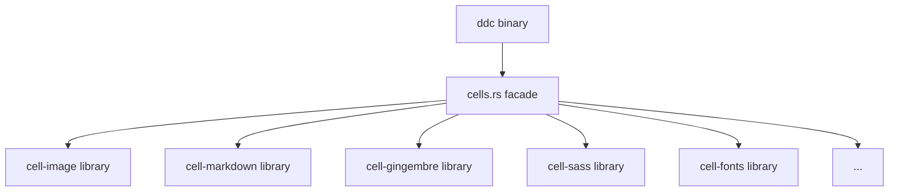

+++
title = "How It Works"
weight = 10
+++

This page gives a high-level view of dodeca's architecture for the curious.

## Host + Processors

dodeca runs as one `ddc` process. Its build pipeline is split into focused processor crates for image processing, markdown rendering, SASS compilation, template rendering, font subsetting, search indexing, and similar work.

These crates still live under `cells/cell-*` paths for history and ownership, but production dispatch is in-process: `crates/dodeca/src/cells.rs` calls the processor implementations directly through typed protocol crates.

```mermaid
graph TD
    Host[ddc binary] --> Facade[cells.rs facade]
    Facade --> img[cell-image library]
    Facade --> md[cell-markdown library]
    Facade --> tpl[cell-gingembre library]
    Facade --> sass[cell-sass library]
    Facade --> font[cell-fonts library]
    Facade --> etc[...]
```

Vox is still used for browser DevTools and editor communication, but not for host-to-processor dispatch.

## Incremental computation

dodeca uses [picante](https://github.com/bearcove/picante) — an async incremental query system similar to Salsa. Every transformation is a tracked query:

- Parse markdown → query
- Render template → query
- Process image → query
- Subset font → query

Queries track their dependencies automatically. When a file changes, picante invalidates only the affected queries and re-runs them. Everything else is served from cache.

The query cache persists across restarts, so even a cold start benefits from previous work.

## Content-addressable storage

Large outputs (processed images, subsetted fonts) are stored in a content-addressable blob store (`.cache/blobs/`). Files are keyed by content hash — if two pages use the same image, it's processed once.

## Live reload

During `ddc serve`, dodeca diffs the old and new HTML using [hotmeal](https://github.com/bearcove/hotmeal) and sends DOM patches to the browser via a small injected script. Only the changed parts of the page update — no full-page reload, no scroll position reset.
