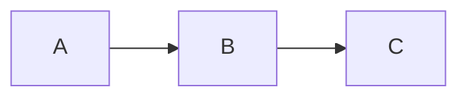

+++
title = "Markdown Features"
weight = 40
+++

dodeca processes markdown through [marq](https://github.com/bearcove/marq), which extends standard markdown with several features.

## Syntax highlighting

Fenced code blocks get syntax highlighting with light and dark themes:

````markdown
```rust
fn main() {
    println!("hello");
}
```
````

Themes are configurable in `dodeca.styx`:

```styx
syntax_highlight {
    light_theme github-light
    dark_theme tokyo-night
}
```

Highlighting is powered by [arborium](https://github.com/bearcove/arborium) (tree-sitter grammars).

## Mermaid diagrams

Fenced code blocks with the `mermaid` language tag are rendered as diagrams client-side:

````markdown

````

The Mermaid.js library is automatically injected when any page uses mermaid blocks.

## Pikchr diagrams

[Pikchr](https://pikchr.org/) diagrams are rendered server-side to SVG:

````markdown
```pikchr
box "Hello"; arrow; box "World"
```
````

## ASCII art diagrams

Code blocks tagged with `aasvg` are converted from ASCII art to SVG:

````markdown
```aasvg
+-------+    +-------+
| Hello |--->| World |
+-------+    +-------+
```
````

## Terminal recordings

You can embed [asciinema](https://asciinema.org/) terminal recordings.

## Table of contents

Headings in your markdown automatically generate a table of contents, accessible in templates as `page.toc` or `section.toc`.
