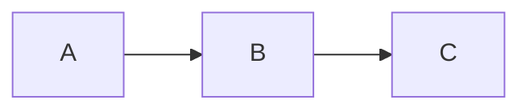

+++
title = "Markdown Features"
weight = 40
+++

dodeca processes markdown through [marq](https://github.com/bearcove/marq), which extends standard markdown with several features.

## Syntax highlighting

Fenced code blocks get syntax highlighting with light and dark themes:

````markdown
```rust
fn main() {
    println!("hello");
}
```
````

Themes are configurable in `dodeca.styx`:

```styx
syntax_highlight {
    light_theme github-light
    dark_theme tokyo-night
}
```

Highlighting is powered by [arborium](https://github.com/bearcove/arborium) (tree-sitter grammars).

## Mermaid diagrams

Fenced code blocks with the `mermaid` language tag are rendered as diagrams client-side:

````markdown

````

The Mermaid.js library is automatically injected when any page uses mermaid blocks.

## Pikchr diagrams

[Pikchr](https://pikchr.org/) diagrams are rendered server-side to SVG:

````markdown
```pikchr
box "Hello"; arrow; box "World"
```
````

## ASCII art diagrams

Code blocks tagged with `aasvg` are converted from ASCII art to SVG:

````markdown
```aasvg
+-------+    +-------+
| Hello |--->| World |
+-------+    +-------+
```
````

## Terminal recordings

Use `ddc term` to start a recorded terminal session. Exit with `Ctrl+D`,
then paste your clipboard's contents straight into your markdown:

```term
<t-b><t-f style="--c:#c1a78e"> dodeca </t-f></t-b><t-b><t-f style="--c:#85b695">› redocs </t-f></t-b><t-b><t-f style="--c:#a3a9ce">󰏗 1</t-f></t-b><t-b><t-f style="--c:#ebc06d">󰏫 1</t-f></t-b><t-b><t-f style="--c:#85b695">󰁝 1 </t-f></t-b><t-b><t-f style="--c:#867462">› 22:35 🪴</t-f></t-b>
<t-b><t-f style="--c:#85b695">› </t-f></t-b>ls -lhA | head -5
<t-u>Permissions Size User Date Modified Name</t-u>
<t-b><t-fblu>d</t-fblu></t-b><t-b><t-fylw>r</t-fylw></t-b><t-b><t-fred>w</t-fred></t-b><t-b><t-fgrn>x</t-fgrn></t-b><t-fylw>r</t-fylw><t-b><t-flblk>-</t-flblk></t-b><t-fgrn>x</t-fgrn><t-fylw>r</t-fylw><t-b><t-flblk>-</t-flblk></t-b><t-fgrn>x     </t-fgrn><t-b><t-flblk>- </t-flblk></t-b><t-b><t-fylw>amos </t-fylw></t-b><t-fblu>21 Dec  2025  </t-fblu><t-b><t-fblu>.cargo</t-fblu></t-b>
<t-b><t-fblu>d</t-fblu></t-b><t-b><t-fylw>r</t-fylw></t-b><t-b><t-fred>w</t-fred></t-b><t-b><t-fgrn>x</t-fgrn></t-b><t-fylw>r</t-fylw><t-b><t-flblk>-</t-flblk></t-b><t-fgrn>x</t-fgrn><t-fylw>r</t-fylw><t-b><t-flblk>-</t-flblk></t-b><t-fgrn>x     </t-fgrn><t-b><t-flblk>- </t-flblk></t-b><t-b><t-fylw>amos </t-fylw></t-b><t-fblu> 5 Feb 11:04  </t-fblu><t-b><t-fblu>.claude</t-fblu></t-b>
<t-b><t-fblu>d</t-fblu></t-b><t-b><t-fylw>r</t-fylw></t-b><t-b><t-fred>w</t-fred></t-b><t-b><t-fgrn>x</t-fgrn></t-b><t-fylw>r</t-fylw><t-b><t-flblk>-</t-flblk></t-b><t-fgrn>x</t-fgrn><t-fylw>r</t-fylw><t-b><t-flblk>-</t-flblk></t-b><t-fgrn>x</t-fgrn>@    <t-b><t-flblk>- </t-flblk></t-b><t-b><t-fylw>amos </t-fylw></t-b><t-fblu>28 Dec  2025  </t-fblu><t-b><t-fblu>.conductor</t-fblu></t-b>
<t-b><t-fblu>d</t-fblu></t-b><t-b><t-fylw>r</t-fylw></t-b><t-b><t-fred>w</t-fred></t-b><t-b><t-fgrn>x</t-fgrn></t-b><t-fylw>r</t-fylw><t-b><t-flblk>-</t-flblk></t-b><t-fgrn>x</t-fgrn><t-fylw>r</t-fylw><t-b><t-flblk>-</t-flblk></t-b><t-fgrn>x     </t-fgrn><t-b><t-flblk>- </t-flblk></t-b><t-b><t-fylw>amos </t-fylw></t-b><t-fblu>18 Jan 20:20  </t-fblu><t-b><t-fblu>.config</t-fblu></t-b>

<t-b><t-f style="--c:#c1a78e"> dodeca </t-f></t-b><t-b><t-f style="--c:#85b695">› redocs </t-f></t-b><t-b><t-f style="--c:#a3a9ce">󰏗 1</t-f></t-b><t-b><t-f style="--c:#ebc06d">󰏫 1</t-f></t-b><t-b><t-f style="--c:#85b695">󰁝 1 </t-f></t-b><t-b><t-f style="--c:#867462">› 22:35 🪴</t-f></t-b>
<t-b><t-f style="--c:#85b695">›</t-f></t-b>
```

## Table of contents

Headings in your markdown automatically generate a table of contents, accessible in templates as `page.toc` or `section.toc`.
