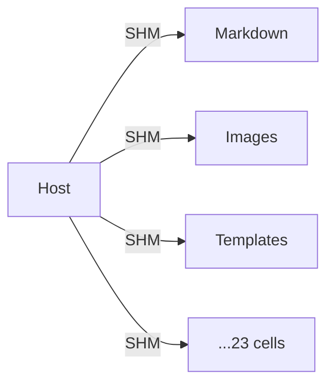
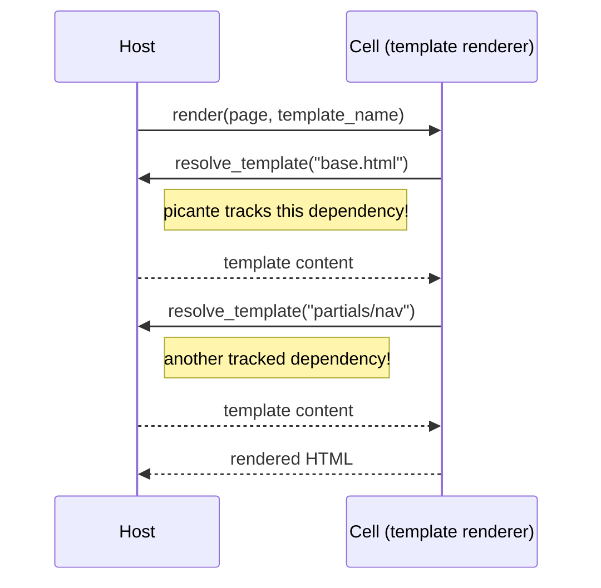
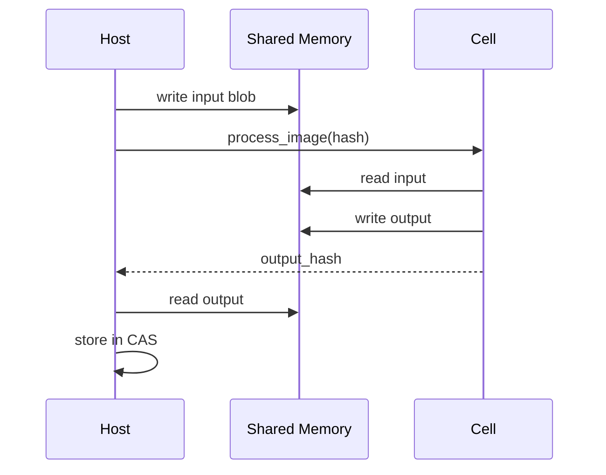
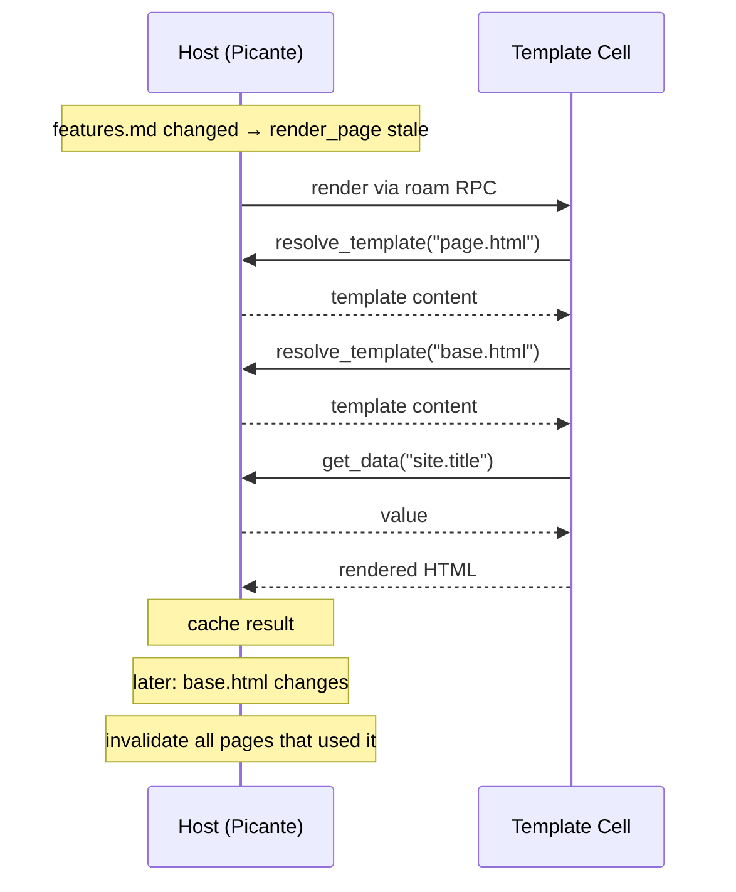

+++
title = "Architecture"
description = "How dodeca's host, cells, and caching layers work together"
weight = 0
+++

The host process is the brain — it tracks dependencies, manages caching, and orchestrates work. Cells are the muscles — stateless worker processes that do the heavy lifting (image processing, template rendering, markdown parsing, etc.) and communicate via shared memory.



The host owns all caching through two complementary systems:

- **Picante** — incremental query runtime. Tracks dependencies between queries, memoizes results, knows exactly what's stale when an input changes. Small outputs (parsed frontmatter, rendered HTML, template ASTs) live here.
- **CAS** — content-addressed blob store. Large outputs (processed images, subsetted fonts) are stored by content hash in `.cache/blobs/`. Picante stores only the hashes, keeping its database small.

Cells have no caching logic. They're pure functions: give them inputs, get outputs. This keeps invalidation simple — one place to reason about staleness.

## Cell callbacks

When a cell needs additional data, it calls back to the host:



The magic: **cell callbacks flow through picante-tracked host APIs**. When the template cell calls `resolve_template("base.html")`, the host:

1. Looks up the template (tracked query)
2. Returns content to cell
3. Picante records the dependency: "this render depends on base.html"

If `base.html` changes later, picante knows to re-render pages that included it — even though the actual rendering happened in a cell.

## Large blobs go through CAS, not Picante

Picante's cache is serialized via facet-postcard. Storing large blobs there would be expensive:

- Slow serialization/deserialization
- Large cache files on disk
- Memory pressure

Instead:

| Data Type | Storage | Why |
|-----------|---------|-----|
| Text content (markdown, templates, SCSS) | Picante (inline) | Small, frequently accessed during queries |
| Binary blobs (images, fonts, PDFs) | CAS | Large, content-addressed, survives restarts |
| Processed outputs (optimized images, subsetted fonts) | CAS | Large, keyed by input hash |

The host stores only **hashes** in picante:

```rust
#[picante::input]
pub struct StaticFile {
    #[key]
    pub path: StaticPath,
    pub content_hash: ContentHash,  // 32 bytes, not megabytes
}
```

When actual content is needed, the host reads from CAS using the hash.

## Shared memory for large transfers

Cells run as separate processes. Transferring large blobs (images, fonts) over RPC would be expensive.

Roam uses shared memory (SHM) for large transfers:



The host:
1. Writes input blob to SHM before calling cell
2. Cell processes in-place or writes output to SHM
3. Host reads output from SHM and stores in CAS

Cells never touch CAS directly — the host handles all persistence.

## Query Flow Example

Here's how a page render flows through the system:



## Cell Categories

| Cell | Inputs | Outputs | Callbacks to Host |
|------|--------|---------|-------------------|
| **Template** (gingembre) | Page data, template name | Rendered HTML | `resolve_template`, `get_data` |
| **SASS** | Entry file path | Compiled CSS | `resolve_import` |
| **Image** | Image bytes (via SHM) | Processed variants (via SHM) | None (pure transform) |
| **Fonts** | Font bytes, char set | Subsetted font (via SHM) | None (pure transform) |
| **Markdown** | Markdown text | Rendered HTML with syntax highlighting | None (pure transform) |
| **HTTP** | Request | Response | `find_content`, `eval_expression` |

"Pure transform" cells don't call back — they receive all inputs upfront and return outputs. These are the simplest to implement and reason about.

Cells with callbacks enable lazy loading and fine-grained dependency tracking, but require careful design of the provider interface.

## Cache Structure

```
.cache/
├── blobs/              # Content-addressed blob storage
│   ├── a1b2/           # Subdirectory by hash prefix
│   │   ├── a1b2c3...img    # processed image data
│   │   └── a1b2d4...ttf    # decompressed font
│   └── e5f6/
│       └── ...
├── cas.db              # Hash store (path → content hash mapping)
├── cas.version         # CAS version for cache invalidation
├── dodeca.bin          # Picante's serialized cache
├── dodeca.version      # Picante cache version
└── code-execution/     # Cached code execution results
```

Benefits:
- **Deduplication**: Same content = same hash = stored once
- **Parallel safety**: Hash-based keys prevent conflicts
- **Survives rebuilds**: Content persists even if picante cache is cleared
- **Easy cleanup**: Delete old hashes not referenced by current build

## Summary

| Concern | Owner | Why |
|---------|-------|-----|
| Dependency tracking | Picante (host) | Single source of truth for staleness |
| Query memoization | Picante (host) | Avoids redundant computation |
| Large blob storage | CAS (host) | Keeps picante cache small |
| Pure computation | Cells | Isolation, independent linking |
| Provider services | Host | Callbacks tracked by picante |

The host is the brain; cells are the muscles. Caching decisions flow through one place, making the system predictable and debuggable.
