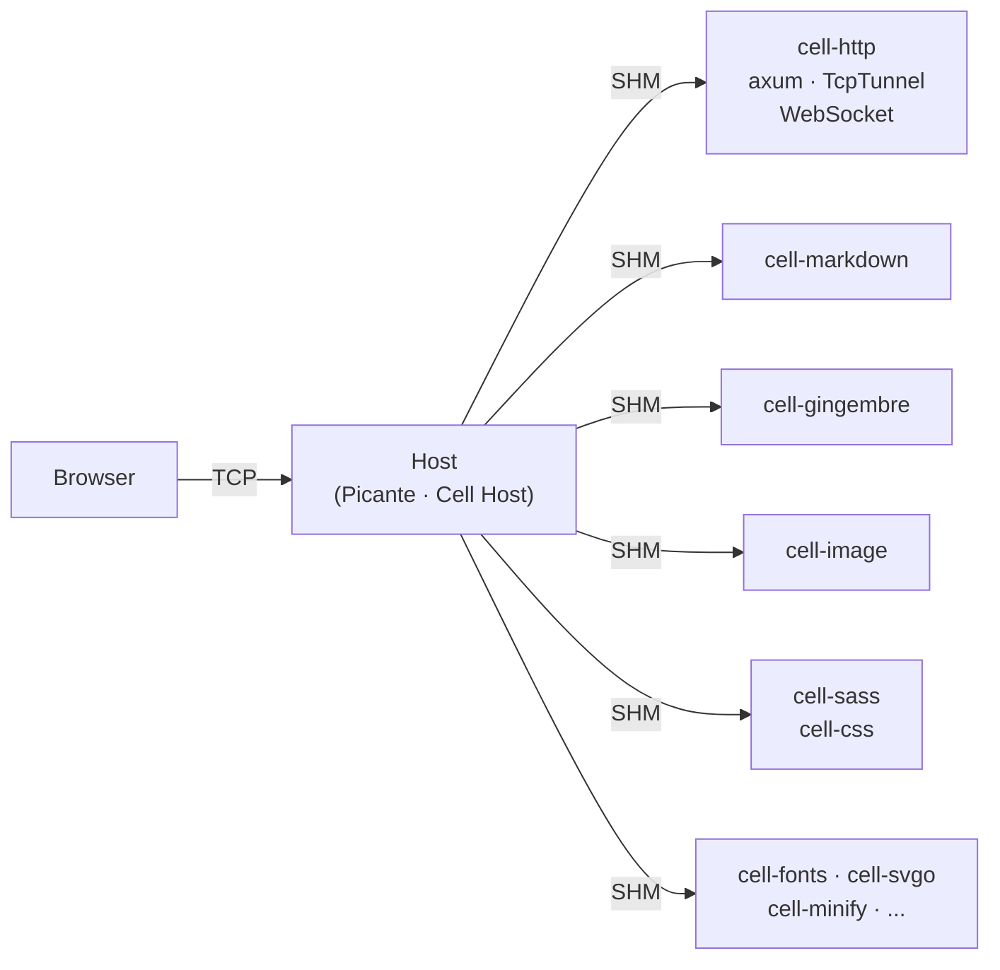
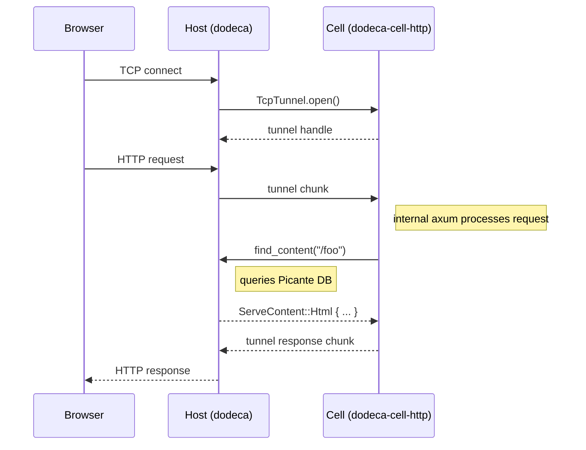

+++
title = "Cells"
description = "Cell architecture for extending dodeca functionality"
weight = 50
+++

## Introduction

Dodeca uses cells to keep the core binary small and fast to link. Heavy dependencies live in cells, which compile and link independently as separate processes.

Cells communicate with the main dodeca process via [roam](https://github.com/bearcove/roam) RPC over shared memory (SHM).

---

## Architecture



## Current Cells

| Cell | Purpose |
|------|---------|
| `cell-http` | HTTP dev server with WebSocket support for live reload |
| `cell-tui` | Terminal UI with ratatui |
| `cell-markdown` | Markdown parsing and rendering |
| `cell-gingembre` | Jinja-like template engine |
| `cell-sass` | SCSS/Sass compilation |
| `cell-css` | CSS processing with lightningcss |
| `cell-js` | JavaScript minification with OXC |
| `cell-image` | Image processing (resize, format conversion) |
| `cell-jxl` | JPEG XL encoding |
| `cell-webp` | WebP encoding |
| `cell-fonts` | Font subsetting with fontcull |
| `cell-svgo` | SVG optimization with svag |
| `cell-html` | HTML processing and manipulation |
| `cell-html-diff` | HTML diffing for live reload |
| `cell-minify` | HTML/JS/CSS minification |
| `cell-linkcheck` | External link checking |
| `cell-code-execution` | Code sample execution for verification |
| `cell-dialoguer` | Interactive CLI prompts |

## Hub Architecture

All cells share a single SHM "hub" file with variable-size slot allocation:

| Slot Size | Count | Purpose |
|-----------|-------|---------|
| 1KB | 1024 | Small RPC args |
| 16KB | 256 | Typical payloads |
| 256KB | 32 | Images, CSS |
| 4MB | 8 | Compressed fonts |
| 16MB | 4 | Decompressed fonts |

Each cell gets:
- A unique `peer_id` assigned by the host
- Its own ring pair (send/recv) within the shared SHM
- A socketpair doorbell for cross-process wakeup

## Benefits

- **Shared memory transfers** - Large payloads go through SHM rather than pipes or sockets
- **Process isolation** - Cells run in separate processes, improving stability
- **Bidirectional RPC** - Both host and cell can initiate calls
- **TCP tunneling** - Browser connections are accepted by host and tunneled to cell
- **Async support** - Full async/await with independent runtimes per cell
- **Variable-size slots** - Font decompression uses 16MB slots while small RPC uses 1KB
- **Fast linking** - Cells link independently, so changing one doesn't relink the main binary

## Directory Organization

Cells live in the `cells/` directory, excluded from the main workspace for independent compilation.

**Directory structure:**

```
cells/
├── cell-http/                 # HTTP dev server cell
│   ├── Cargo.toml            # package: cell-http, bin: dodeca-cell-http
│   └── src/main.rs
├── cell-http-proto/          # HTTP cell protocol definitions
│   ├── Cargo.toml            # package: cell-http-proto
│   └── src/lib.rs
├── cell-image/               # Image processing cell
│   ├── Cargo.toml
│   └── src/main.rs
└── cell-image-proto/         # Image processing protocol
    ├── Cargo.toml
    └── src/lib.rs
```

**Naming convention:**

Each cell follows this pattern:

1. **Cell binary**: `cells/cell-{name}/`
   - Cargo package name: `cell-{name}`
   - Binary name: `dodeca-cell-{name}` (defined in `[[bin]]` section)

2. **Protocol crate**: `cells/cell-{name}-proto/`
   - Cargo package name: `cell-{name}-proto`
   - Contains `#[roam::service]` trait definitions

3. **Dependencies**:
   - Cell depends on its protocol via relative path: `{ path = "../cell-{name}-proto" }`
   - Both use roam framework crates

4. **Workspace exclusion**:
   - The root `Cargo.toml` excludes cells: `exclude = ["cells/*"]`
   - This allows cells to have independent dependency versions and compile separately

## Communication Flow

Host and cell communicate bidirectionally via shared memory:



The host accepts browser TCP connections and tunnels them to the cell via `TcpTunnel`. The cell processes HTTP requests internally and calls back to the host for content via `ContentService`.

## Protocol Definition

Cells use trait-based protocol definitions with the `#[roam::service]` macro:

```rust
#[roam::service]
pub trait ContentService {
    async fn find_content(&self, path: String) -> ServeContent;
    async fn get_scope(&self, route: String, path: Vec<String>) -> Vec<ScopeEntry>;
    async fn eval_expression(&self, route: String, expression: String) -> EvalResult;
}
```

The macro generates:
- Client types for making RPC calls
- Server types for handling RPC calls  
- Serialization/deserialization via facet

## Creating a Cell

To create a new cell:

1. **Create the protocol crate** at `cells/cell-example-proto/`
   - Package name: `cell-example-proto`
   - Define RPC traits using `#[roam::service]`

2. **Create the cell binary** at `cells/cell-example/`
   - Package name: `cell-example`
   - Binary name: `dodeca-cell-example`
   - Depend on `cell-example-proto` via relative path

3. **Implement the cell** using `run_cell!` macro:

```rust
use dodeca_cell_runtime::run_cell;
use cell_example_proto::{ExampleServiceDispatcher, ExampleServiceImpl};

fn main() {
    run_cell!("example", |_handle| {
        ExampleServiceDispatcher::new(ExampleServiceImpl)
    });
}
```

For cells that need to call back to the host:

```rust
fn main() {
    run_cell!("example", |handle| {
        let processor = ExampleImpl::new(handle);
        ExampleServiceDispatcher::new(processor)
    });
}
```

4. **Register in host** - Add to `crates/dodeca/src/cells.rs` using `define_plugins!` macro

See existing cells like `cell-image` (pure transform) or `cell-http` (with callbacks) for complete examples.

## Why Cells?

The primary motivation is **link speed**. Rust's incremental compilation is fast, but linking a large binary with many dependencies is slow. By moving functionality into cells:

- The main `dodeca` binary stays small and links fast
- Cells compile and link independently
- Changing a cell doesn't require relinking the main binary
- Heavy dependencies (image processing, font subsetting, HTTP) are isolated
