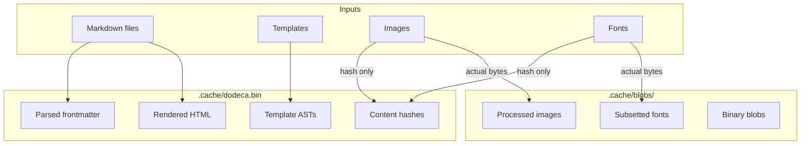

+++
title = "Dual Cache Architecture"
weight = 31
+++

dodeca uses two caches: Picante for the computation graph, and a content-addressed store for large blobs.

Picante tracks dependencies and stores small outputs like parsed frontmatter, rendered HTML, and template ASTs. It stays in memory during a session and persists between runs to `.cache/dodeca.bin`.

Large outputs—processed images, subsetted fonts, any binary blob—go to a separate content-addressed store in `.cache/blobs/`. Files are named by content hash, so identical content is never stored twice. Picante stores only the **hashes** of large outputs, keeping its database small.

When you edit a markdown file, Picante invalidates just the affected queries. The rendered HTML recomputes, but images with unchanged content skip reprocessing entirely—their hash is already in the blob cache.

On startup, both caches load from disk. Most queries can reuse cached results; only changed inputs trigger recomputation. A "cold" build can still be fast if you've built the same project before.
