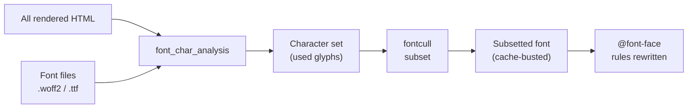

+++
title = "Font Subsetting"
weight = 32
+++

dodeca scans all rendered HTML to find which characters are actually used, then strips everything else from your font files. A 300KB font typically becomes 15-30KB.



After rendering, we collect every character that appears in the output. For each font file, [fontcull](https://github.com/bearcove/fontcull) removes unused glyphs and OpenType features. The subsetted font gets a content hash and CSS `@font-face` rules are rewritten to match.

Most edits don't introduce new characters, so the subsetted font stays cached. When the character set does change, only fonts containing those characters are re-subset.

Variable fonts work too—subsetting preserves variation axes while removing unused glyphs.

```
fonts/inter.woff2: 285KB → 24KB (91% reduction)
fonts/fira-code.woff2: 178KB → 18KB (90% reduction)
```
