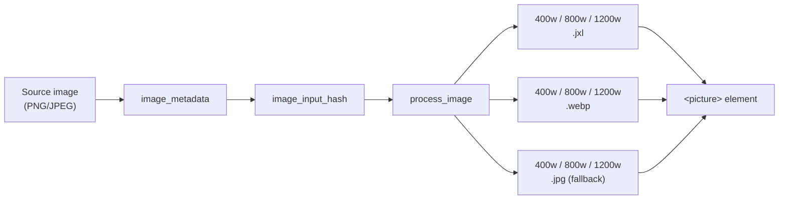

+++
title = "Image Processing"
weight = 23
+++



A single markdown image becomes a responsive `<picture>` with JPEG XL, WebP, and JPEG fallbacks at multiple sizes:

```html
<picture>
  <source srcset="/images/mountain.400w.jxl 400w,
                  /images/mountain.800w.jxl 800w,
                  /images/mountain.1200w.jxl 1200w"
          type="image/jxl">
  <source srcset="..." type="image/webp">
  
</picture>
```

Browsers pick the best format they support. All images get `loading="lazy"`.

Processed images are cached in `.cache/blobs/`. Unchanged images skip reprocessing entirely.
