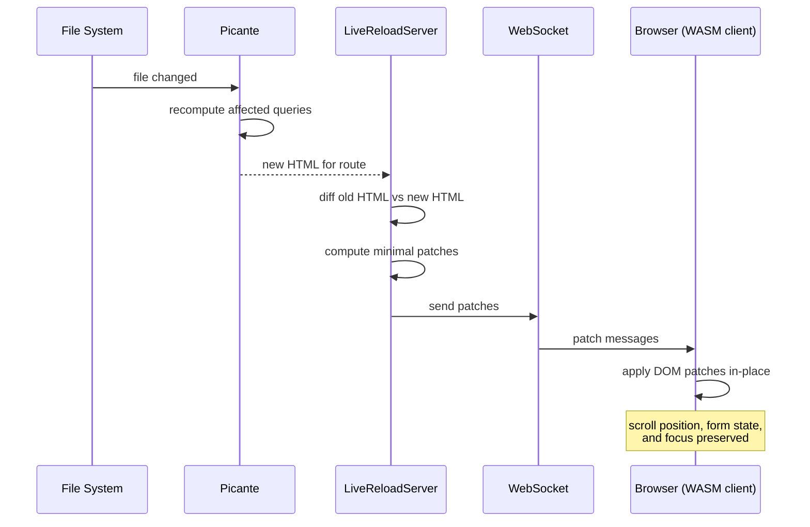

+++
title = "Live Reload"
weight = 22
+++

Instead of refreshing the page, dodeca patches the DOM directly. You keep your scroll position, form state, and focus.



When a file changes, Picante rebuilds only what's affected. The server diffs the old and new HTML using [hotmeal](https://github.com/bearcove/hotmeal)'s tree diffing algorithm, computes minimal edit operations, and sends them over WebSocket. A small WASM client applies the patches—replacing nodes, updating text, adding or removing attributes—without touching anything that didn't change.

```rust
enum Patch {
    Replace { path: NodePath, html: String },
    InsertBefore { path: NodePath, html: String },
    Remove { path: NodePath },
    SetText { path: NodePath, text: String },
    SetAttribute { path: NodePath, name: String, value: String },
    // ...
}
```

CSS is simpler: we just update the `<link>` href to the new cache-busted URL and let the browser fetch it.

If patching fails (rare), we fall back to a full reload.
