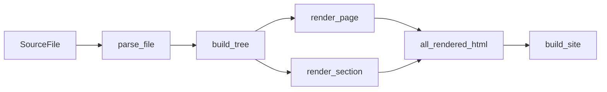
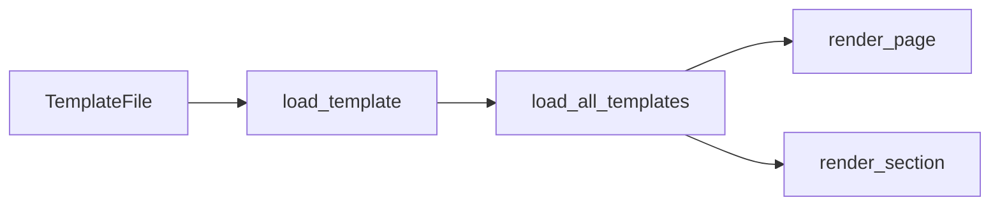
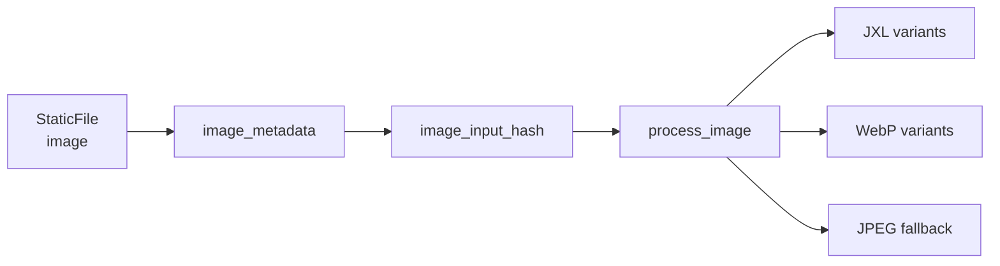
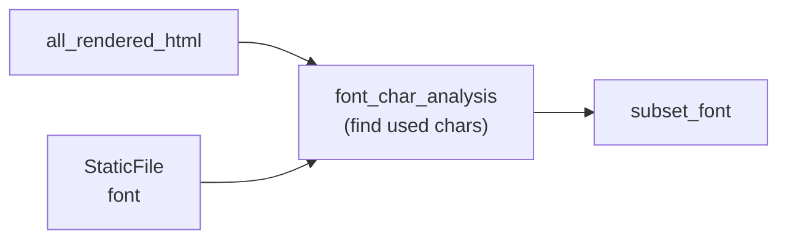
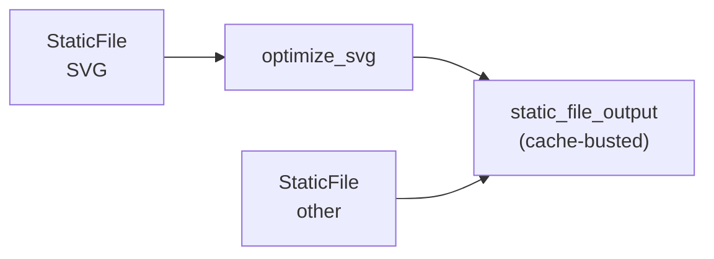

+++
title = "Query Reference"
weight = 30
+++

Every computation is a Picante query. Queries are memoized and track dependencies automatically.

## Inputs

Raw data from disk — these are `#[picante::input]` types that enter the system when files change:

`SourceFile`, `TemplateFile`, `SassFile`, `StaticFile`, `OgTemplateFile`.

## Content Pipeline

## Template Pipeline

## Style Pipeline

## Image Pipeline

## Font Pipeline

## Asset Pipeline

